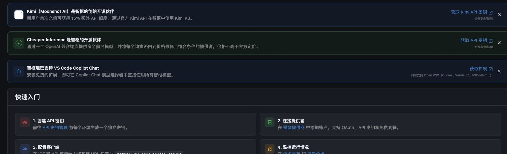
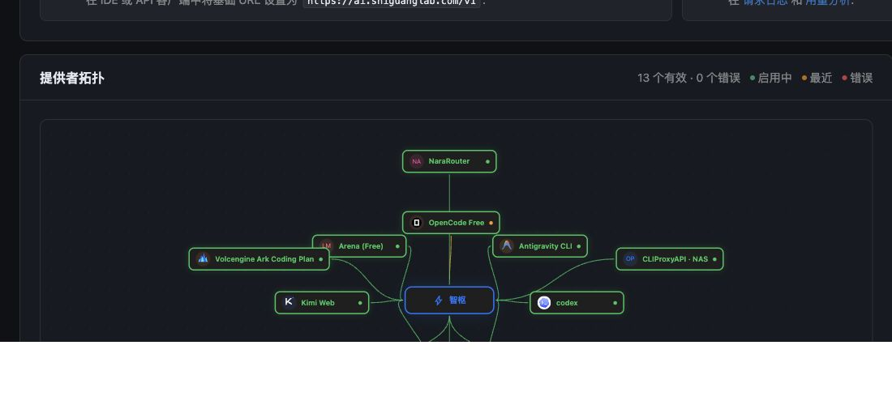

<p align="center">
  
</p>

<h1 align="center">🚀 智枢 Orbit — 统一的大模型网关</h1>

<p align="center">
  <strong>一个端点连接模型、订阅账号、免费服务与本地推理。</strong><br/>
  自动路由、配额感知、故障切换、上下文压缩、MCP、A2A 和完整可观测性，全部运行在你自己的基础设施中。
</p>

<p align="center">
  <a href="https://ai.shiguanglab.com">在线系统</a> ·
  <a href="./RELEASE.md">发布与部署</a> ·
  <a href="./DOMAIN_BOUNDARIES.md">架构边界</a> ·
  <a href="./MIGRATION_SPEC.md">迁移规范</a>
</p>

<p align="center">
  <a href="https://github.com/shiguang-lab/orbit/actions"></a>
  <a href="https://github.com/shiguang-lab/orbit/pkgs/container/orbit-gateway"></a>
  
  
</p>

## 💥 核心承诺

把 Claude Code、Codex、Cursor、OpenCode、Cline、Copilot 等客户端指向同一个 OpenAI/Anthropic 兼容端点，Orbit 负责其余工作：

- **统一接入**：API Key、OAuth、Web、CLI、云平台代理和本地模型使用同一套目录与管理体验。
- **持续可用**：连接冷却、模型锁定、Provider 熔断和多层自动故障转移相互独立。
- **配额优先**：识别小时、日、周、月和信用额度窗口，按剩余额度、重置时间、成本或延迟路由。
- **节省上下文**：多引擎压缩、上下文接力、缓存优化与按请求预算控制，减少不必要的 Token 消耗。
- **本地优先**：凭据和调用数据保存在自己的 SQLite/数据卷中，服务可完全独立部署。
- **可观测**：请求日志、用量、成本、配额、异常、Provider 健康和编排运行状态集中展示。

## 🧩 能力概览

| 能力 | Orbit |
|---|---|
| 协议端点 | OpenAI Chat/Responses、Anthropic Messages、模型、图片、音频、文件 |
| Provider 生态 | 订阅账号、API Key、Web/浏览器、CLI、本地服务与上游代理 |
| 路由策略 | 20 种公开 Combo 策略，另含自动评分、SLA、成本和延迟策略 |
| 可用性 | Provider 熔断、连接冷却、模型锁定、健康巡检、LKGP |
| 配额 | 实时查询、窗口标准化、预检、配额加权和耗尽自动跳过 |
| 上下文 | 主动压缩、智能预算、上下文接力、缓存优化、RTK/Caveman |
| Agent 协议 | MCP、A2A、Skills、Cloud Agent、编排画布 |
| 管理与审计 | RBAC、API Key ACL、请求日志、成本、异常、审计与导出 |
| 部署 | Gateway、Control、Realtime、Worker、Console 独立进程/镜像 |

## 🎯 Combo — 智能路由核心

客户端只需调用一个稳定的模型名称，Combo 会从候选模型和账号中选择当前最合适的目标。

```text
客户端 / IDE
      │
      ▼
https://ai.shiguanglab.com/v1
      │
      ▼
Orbit Gateway ── 配额预检 ── 健康状态 ── 路由策略
      │
      ├── 订阅账号
      ├── API Key Provider
      ├── 免费 / Web / CLI Provider
      └── 本地模型或上游网关
```

公开策略包括：

`priority` · `weighted` · `round-robin` · `fill-first` · `p2c` · `random` · `strict-random` · `least-used` · `cost-optimized` · `headroom` · `reset-aware` · `reset-window` · `quota-weighted` · `context-relay` · `context-optimized` · `cache-optimized` · `lkgp` · `auto` · `fusion` · `pipeline`

`auto` 还可以使用规则、综合评分、成本、延迟和 SLA 感知策略，并结合实时可靠性、在途负载与模型能力做决策。

## 🧱 三层自愈

<p align="center">
  
</p>

1. **Provider 熔断**：上游整体故障时暂停选择，并通过半开探测自动恢复。
2. **连接冷却**：单个账号或 Key 限流时只跳过该连接，同 Provider 的其他连接继续服务。
3. **模型锁定**：某一模型不可用时仅锁定对应模型，不扩大到整个账号或 Provider。

配额耗尽、鉴权失效、套餐限制、瞬态网络错误和本机执行错误采用不同分类，避免一次局部失败拖黑完整资源池。

## 🤖 兼容客户端与 Agent

Orbit 提供 OpenAI 和 Anthropic 兼容入口，可用于：

- Claude Code、OpenAI Codex、OpenCode
- Cursor、Cline、Continue、Aider、Kilo Code
- GitHub Copilot CLI / VS Code Copilot Chat
- 任何可配置 OpenAI Base URL 的 SDK、IDE、Agent 或自动化工具

客户端基础地址：

```text
https://ai.shiguanglab.com/v1
```

OpenAI SDK 示例：

```bash
curl https://ai.shiguanglab.com/v1/chat/completions \
  -H "Authorization: Bearer $ORBIT_API_KEY" \
  -H "Content-Type: application/json" \
  -d '{
    "model": "auto",
    "messages": [{"role": "user", "content": "你好，Orbit"}]
  }'
```

## 🔌 MCP、A2A 与 Skills

- **MCP**：通过内置服务向 Agent 暴露模型、Provider、配额和运维工具。
- **A2A**：记录并展示 Agent 生命周期、执行历史与 Repeat 操作。
- **Skills**：支持受控命令、JavaScript 和 Python 沙箱；默认 JavaScript 镜像为 Node.js 24.20.0。
- **编排画布**：统一查看 Cloud Agent、A2A、Conductor 和 Combo 的实时拓扑。

## 🗜️ 上下文与 Token 优化

Orbit 在请求进入 Provider 前提供可组合的上下文处理能力：

- 主动上下文压缩与实时阈值调节
- Adaptive Context Budget
- RTK、Caveman、六层压缩、语义与结构化压缩
- Context Relay / Universal Context Handoff
- Prompt Cache 和 Cache-aware Routing
- 工具结果预算与超长输出保护

具体节省比例取决于内容结构、所选引擎和模型，管理台会展示真实调用量与缓存读写数据。

## 🔒 私有、自托管、可拆分

Orbit 是独立部署的 monorepo：

```text
orbit/
├── apps/
│   ├── gateway/       # 对外模型协议与请求入口
│   ├── control/       # 管理 API、RBAC、配置和审计
│   ├── realtime/      # WebSocket / SSE
│   ├── worker/        # 定时任务与后台作业
│   ├── console/       # React 19 + Vite 管理台
│   └── cli/           # 本地与远程管理 CLI
├── packages/
│   ├── core/          # 领域、数据与协议能力
│   ├── inference/     # 推理执行、路由和转换
│   ├── providers/     # Provider 注册表与模型目录
│   ├── contracts/     # 共享 API/DB 契约
│   ├── http/          # HTTP 基础设施
│   ├── config/        # 共享配置
│   └── utils/         # 错误、日志与网络工具
└── deploy/            # NAS / Compose 部署资源
```

应用之间只通过网络 API 或 `packages/contracts` 交互。完整边界见 [DOMAIN_BOUNDARIES.md](./DOMAIN_BOUNDARIES.md)。

## ⚡ 快速开始

### 环境要求

- Node.js `>=24.20.0 <25`
- pnpm `10.28.0`
- 可选：Docker / Docker Compose

### 从源码运行

```bash
git clone https://github.com/shiguang-lab/orbit.git
cd orbit
corepack enable
pnpm install

# 在不同终端启动各进程
pnpm dev:edge
pnpm dev:control
pnpm dev:realtime
pnpm dev:worker
pnpm dev:console
```

默认开发端口：

| 服务 | 地址 |
|---|---|
| Gateway | `http://127.0.0.1:8787` |
| Control | `http://127.0.0.1:8788` |
| Realtime | `http://127.0.0.1:8790` / WS `20132` |
| Console | `http://127.0.0.1:5173` |

### Docker Compose

```bash
cp .env.example .env
# 设置稳定的 JWT_SECRET、API_KEY_SECRET 及部署所需配置
docker compose up -d
```

正式镜像由 `v*` Git Tag 触发发布：

```text
ghcr.io/shiguang-lab/orbit-console:<tag>
ghcr.io/shiguang-lab/orbit-gateway:<tag>
ghcr.io/shiguang-lab/orbit-control:<tag>
ghcr.io/shiguang-lab/orbit-realtime:<tag>
ghcr.io/shiguang-lab/orbit-worker:<tag>
ghcr.io/shiguang-lab/orbit-cliproxy-manager:<tag>
```

发布检查、Tag、产物和 NAS 更新流程见 [RELEASE.md](./RELEASE.md)。

## 🛠️ 技术栈

| 层 | 技术 |
|---|---|
| Runtime | Node.js 24.20 LTS、TypeScript、ES Modules |
| Monorepo | pnpm workspace、Turborepo |
| Backend | NestJS、Fastify |
| Console | React 19、Vite、Ant Design |
| Storage | SQLite（better-sqlite3 / node:sqlite / sql.js） |
| Realtime | WebSocket、Server-Sent Events |
| Protocols | OpenAI、Anthropic、MCP、A2A |
| Deployment | Docker BuildKit、Docker Compose、GHCR |

## 📖 项目文档

- [发布与 NAS 部署](./RELEASE.md)
- [应用及领域边界](./DOMAIN_BOUNDARIES.md)
- [迁移规范](./MIGRATION_SPEC.md)
- [包职责说明](./packages/README.md)
- [环境变量参考](./packages/core/docs/reference/ENVIRONMENT.md)
- [CLI 工具](./packages/core/docs/reference/CLI-TOOLS.md)
- [故障排查](./packages/core/docs/guides/TROUBLESHOOTING.md)
- [架构说明](./packages/core/docs/architecture/ARCHITECTURE.md)

## 🙏 上游与致谢

Orbit 的模型网关能力持续吸收 [OmniRoute](https://github.com/diegosouzapw/OmniRoute) 的优秀实现，并在独立多进程架构、统一身份、真实数据源和 NAS 部署方向进行适配与扩展。

感谢所有上游贡献者，以及为模型、协议、压缩、数据库和开源生态提供基础能力的项目。

---

<p align="center">
  <strong>一个端点，连接你的全部 AI 能力。</strong><br/>
  <a href="https://ai.shiguanglab.com">ai.shiguanglab.com</a>
</p>
